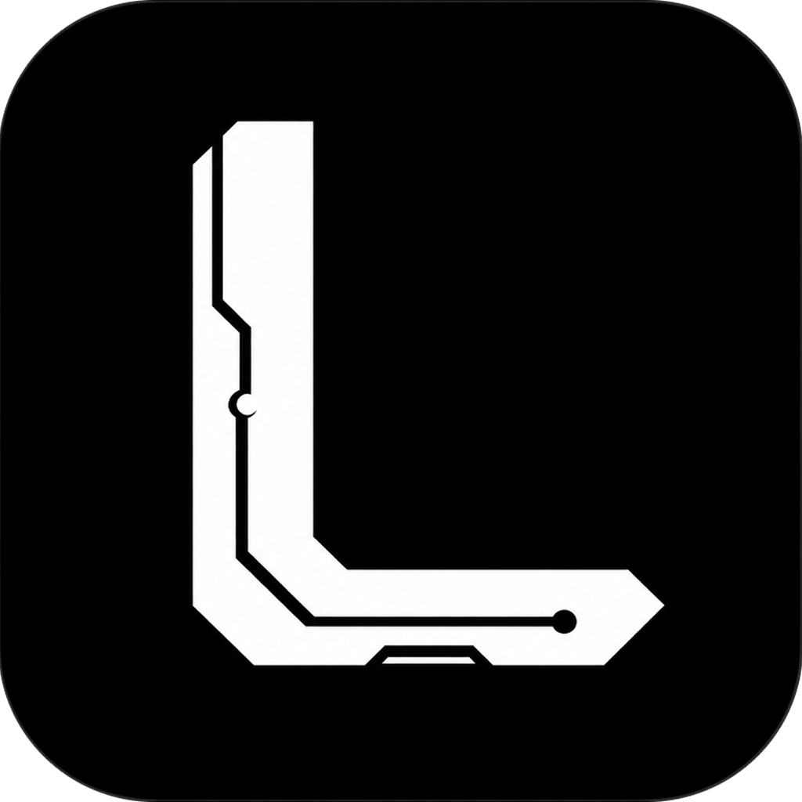
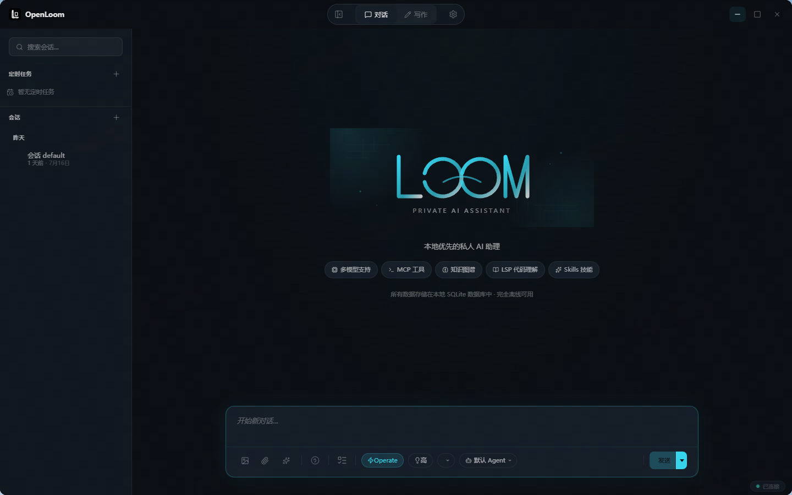
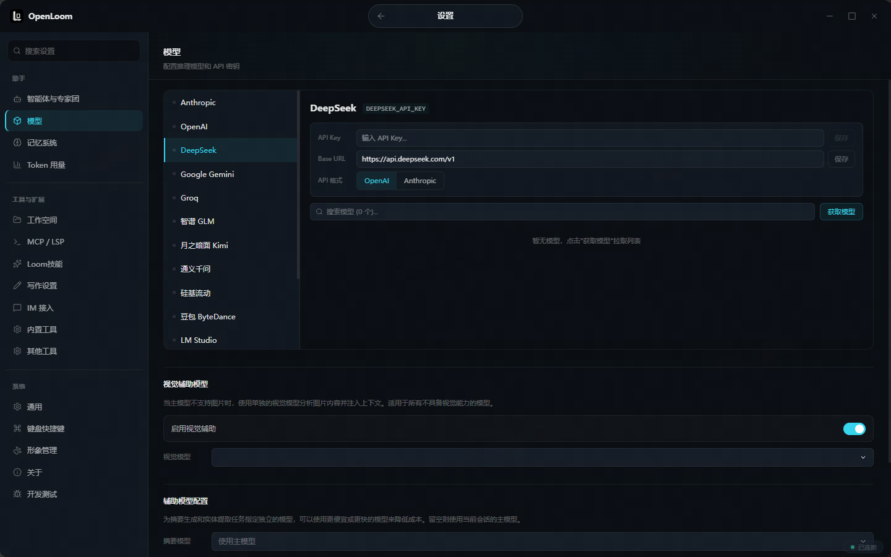
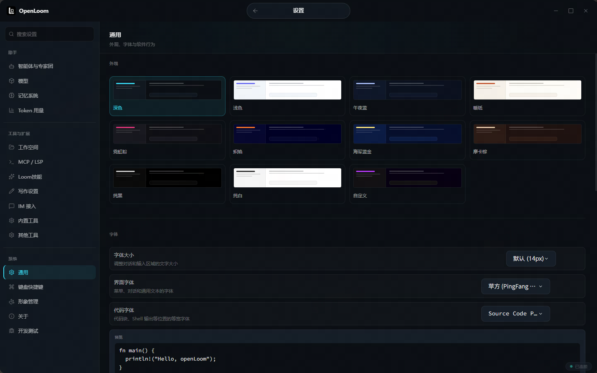

# openLoom

<p align="center">
  
</p>

<p align="center">
  <strong>本地优先、可扩展的个人 AI 工作台。</strong><br />
  将桌面对话、多 Agent 协作、长期记忆、工具调用与写作工作区整合到一个应用中。
</p>

<p align="center">
  <a href="https://github.com/godsir/openloom/releases"></a>
  <a href="LICENSE"></a>
  
  
</p>

<p align="center">
  <a href="#快速开始">快速开始</a> ·
  <a href="#核心能力">核心能力</a> ·
  <a href="#界面预览">界面预览</a> ·
  <a href="#开发">开发</a> ·
  <a href="https://github.com/godsir/openloom/releases">下载</a>
</p>

---

## 为什么是 openLoom？

openLoom 是一个面向个人工作流的桌面 AI 助手。它把模型选择、上下文与长期记忆、MCP/Skills 工具、Agent 协作和写作环境放在同一个本地优先的工作台中；你可以连接云端模型，也可以接入本机的 LM Studio 或 Ollama。

- **本地优先**：会话、记忆和工作区数据默认保存在本机的 SQLite 数据库中。
- **模型自由**：支持 OpenAI、Anthropic、DeepSeek，以及兼容 OpenAI API 的本地或自托管服务。
- **可组合自动化**：通过 MCP、Skills、LSP、计划与定时任务扩展助手能力。
- **桌面级体验**：原生窗口、主题、多语言、自动更新、托盘和可选桌面宠物。
- **口头化操作**：通过和AI对话快速操作loom的所有能力（主题、agent智能体增减、配置API等所有loom可见的功能）。
- **灵动岛**：顶部区域拥有灵动岛，丰富您的使用体验。

## 界面预览

<p align="center">
  
</p>

<p align="center"><em>对话工作台：会话管理、任务、Agent 选择、权限与思考等级集中在同一界面。</em></p>

<p align="center">
  
</p>

<p align="center"><em>模型配置：集中管理云端、本地与自定义供应商，并支持视觉辅助模型。</em></p>

<p align="center">
  
</p>

<p align="center"><em>设置中心：统一管理主题、界面偏好、快捷键、工具与连接配置。</em></p>

## 核心能力

| 能力 | 说明 |
| --- | --- |
| 对话与 Agent 协作 | 多会话、流式响应、Agent 配置、子 Agent 与专家团协作。 |
| 长期记忆 | 基于 SQLite、全文检索与知识图谱保存、检索和关联重要信息。 |
| 模型管理 | 支持 OpenAI、Anthropic、DeepSeek、Gemini、Groq、LM Studio、Ollama 及自定义 OpenAI 兼容服务。 |
| MCP 与 Skills | 支持 stdio、HTTP/SSE MCP 传输，以及 Claude Code / OpenClaw 格式的 Skills。 |
| 写作与代码 | 内置编辑器、文件工作区、AI 选区操作、FIM 补全与 LSP 语言服务。 |
| 工作流 | 计划、待办、定时任务、Token 用量统计和知识图谱可视化。 |
| 消息接入 | 可配置 Telegram、飞书、微信及其他消息渠道，并将消息路由给指定 Agent。 |

## 架构

```text
┌─────────────────────────────────────────────────────────────────┐
│                         openLoom Desktop                         │
│                  Electron 38 · React 19 · Zustand                │
├───────────────────────┬─────────────────────────────────────────┤
│  对话 / 写作 / 设置    │  预加载层：安全 IPC 桥接                 │
└───────────────────────┴──────────────────────┬──────────────────┘
                                                 │ JSON-RPC / WS
┌────────────────────────────────────────────────▼────────────────┐
│                       Rust workspace (Tokio)                     │
│  loom-server · loom-core · loom-inference · loom-memory          │
│  loom-mcp · loom-skills · loom-lsp · loom-cron · loom-bridge     │
└─────────────────────────────────────────────────────────────────┘
```

## 快速开始

### 下载桌面应用

前往 [Releases](https://github.com/godsir/openloom/releases) 下载对应平台的安装包：

- Windows：NSIS `.exe`
- macOS：`.dmg` 或 `.zip`
- Linux：`.AppImage`

首次启动后，在“设置 → 模型”中添加模型供应商和 API Key；也可以配置 LM Studio、Ollama 等本地服务。

### 从源码运行

**前置条件**

- Rust `1.85+`
- Node.js `20+`
- 至少一个模型服务：云端 API Key，或已启动的 LM Studio / Ollama

```powershell
# 克隆仓库后，在根目录构建后端
cargo build -p loom-cli --release

# 启动桌面开发环境
cd frontend
npm ci
npm run dev
```

可选：单独启动后端服务。

```powershell
.\target\release\loom.exe serve --port 8080
```

## 配置与数据

默认数据目录：

| 平台 | 目录 |
| --- | --- |
| Windows | `%USERPROFILE%\.loom\` |
| macOS / Linux | `~/.loom/` |

其中包含会话、SQLite 数据库、记忆、Skills、MCP 配置和运行日志。请勿将其中的 API Key 或个人数据提交到版本库。

参考配置见 [config.example.toml](config.example.toml)，完整接口说明见 [API 文档](docs/api.md)。

## 开发

```powershell
# Rust
cargo check --workspace
cargo test --workspace
cargo fmt --all -- --check
cargo clippy --workspace -- -D warnings

# 前端
cd frontend
npm run typecheck
npm test -- --run
npm run build
```

### 打包

先构建与当前平台匹配的 Rust 引擎，再打包桌面应用：

```powershell
cargo build -p loom-cli --release
cd frontend
npm ci
npm run package
```

产物位于 `frontend/dist/`。如需生成自动更新元数据，使用 `npm run package:updater`。

## 许可证

openLoom 使用 [Apache-2.0](LICENSE) 许可证。
